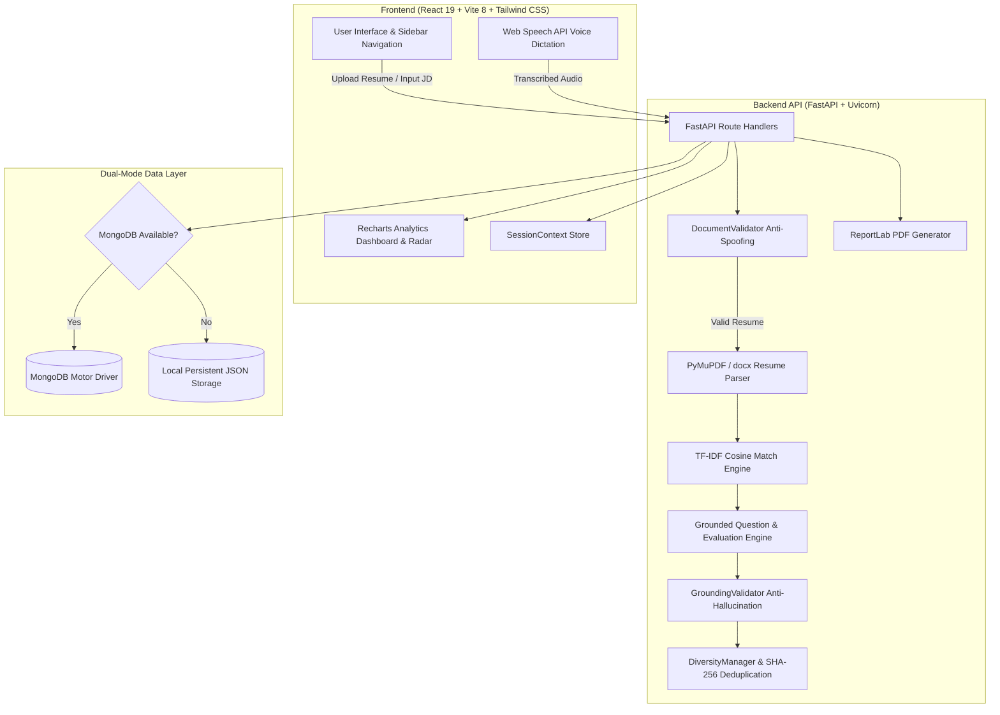

# Resume Interview AI 🎯

<div align="center">

[](https://fastapi.tiangolo.com)
[](https://react.dev)
[](https://vitejs.dev)
[](https://tailwindcss.com)
[](https://python.org)
[](https://opensource.org/licenses/MIT)

**Grounded, Explainable Resume-to-Interview Question Generator & Adaptive Mock Interview Platform**

</div>

---

## 📌 Executive Summary

**Resume Interview AI** is an enterprise-grade, full-stack career readiness platform designed to solve the critical pitfalls of conventional AI interview prep tools: **generic, hallucinated questions and unexplained "black-box" scores**.

By parsing candidate resumes (PDF/DOCX) using high-precision document extraction, anti-spoofing validation, and aligning them against target Job Descriptions (JDs) via deterministic TF-IDF cosine similarity, the application generates **strictly grounded questions** tied directly to verified candidate projects, technical skills, and role requirements. The platform provides an **adaptive mock interview simulator** with real-time 6-axis answer scoring, voice dictation via the Web Speech API, zero-duplicate question regeneration, architectural deep-dives, skill gap roadmaps, STAR-format resume bullet optimization, Recharts visual analytics, and downloadable ReportLab PDF readiness reports.

---

## 🌟 Key Features & Innovations

### 1. 📄 Multi-Format Resume Ingestion & 8-Factor Explainable Scoring
- **Multi-Format Extraction**: Ingests PDF and DOCX files using PyMuPDF (`fitz`) and `python-docx` with automated segmentation for contact details, technical skills, projects, work experience, education, certifications, and achievements.
- **Document Anti-Spoofing & Validation**: Built-in `DocumentValidator` detects and filters out research papers, certificates, assignments, and non-resume documents using weighted pattern matching and negative marker heuristics.
- **Explainable Multi-Dimensional Score (0–100)**: Evaluates resumes across 8 granular categories:
  - 🛠️ *Skills Breadth & Category Diversity* (25%)
  - 🏗️ *Project Complexity & Implementation Depth* (25%)
  - 💼 *Work Experience & Documented Impact* (15%)
  - 🎓 *Education & Degree Relevance* (10%)
  - 📋 *Structural Completeness & Contact Metadata* (10%)
  - 📜 *Industry Certifications* (5%)
  - 🏆 *Verified Achievements & Awards* (5%)
  - 🎯 *Job Description Alignment / Baseline Relevance* (5%)
- **Natural Language Rationale**: Generates actionable strength summaries and specific improvement areas justifying every component score.

### 2. 🎯 Semantic Resume-to-Job Matching Engine
- **Deterministic TF-IDF & Cosine Similarity**: Computes mathematical semantic alignment between candidate profile vectors and target job descriptions.
- **Categorized Competency Breakdown**:
  - ✅ **Matching Skills**: Verified overlap between candidate experience and role requirements.
  - ❌ **Missing Critical Skills**: Key required competencies absent from the candidate resume.
  - ⚠️ **Partial / Related Skills**: Transferable competencies requiring domain adaptation.
- **Project Tailoring & Relevance Ranking**: Identifies and ranks candidate projects most relevant to the target role with justification highlights.

### 3. 💡 Strictly Grounded Interview Question Generation
- **Zero-Hallucination Guarantee**: Features a strict `GroundingValidator` that cross-references all generated questions against verified resume items, preventing invented tools or hallucinated experiences.
- **23-Archetype Diversity Manager**: Enforces balanced rotation across architectural, problem-solving, behavioral, trade-off, and debugging question archetypes.
- **Comprehensive Question Anatomy**:
  - **Question Text**: Targeted technical, behavioral, or architectural prompt.
  - **Based On**: Explicit anchor point (e.g., `Project: Resume Interview AI`, `Skill: MongoDB`).
  - **Difficulty Level**: `Easy`, `Medium`, `Hard`, or `Expert`.
  - **Why This Question?**: Clear explainability rationale linking the JD requirement to the candidate resume item.
  - **Expected Answer Talking Points & Model Strategy**: Architectural guideposts for a structured candidate response.

### 4. 🔄 Zero-Duplicate Question Regeneration Engine
- **Session-Tracked Content Hashing**: Uses SHA-256 content hashing and session-level history tracking to prevent repetitive prompts.
- Clicking *"Generate Different Questions"* guarantees 100% fresh questions without repeating previously seen questions within the active session.

### 5. 🎙️ Adaptive AI Mock Interview Simulator
- **Dual-Input Modality**: Supports typed text and hands-free **Voice Dictation (Speech-to-Text via browser-native Web Speech API)**.
- **Real-Time 6-Axis Answer Evaluation**:
  1. *Relevance* (0–100) — Direct alignment with the core question prompt.
  2. *Technical Accuracy* (0–100) — Precision of concepts, algorithms, and tooling.
  3. *Completeness* (0–100) — Coverage of key requirements and edge cases.
  4. *Clarity* (0–100) — Logical organization, conciseness, and readability.
  5. *Confidence* (0–100) — Assertive, authoritative communication style.
  6. *Communication* (0–100) — Structural flow, vocabulary, and delivery.
- **Domain Concept Extraction & Misconception Penalties**: Detects mentioned domain terms while penalizing inaccurate technical claims.
- **Dynamic Difficulty Progression**: Scoring 85+ on Medium automatically scales subsequent questions to Hard/Expert; scores below 50 gently adapt down to reinforce foundational concepts.
- **Senior Model Answer Synthesis**: Provides ideal answer breakdowns and STAR feedback for candidate self-reflection.

### 6. 🏛️ Project Deep-Dive & Architecture Dossier
- In-depth architectural dossiers for any parsed project:
  - **High-Level System Architecture & Component Interaction Flow**
  - **Database Choice & Data Modeling Trade-offs**
  - **API Contract Validation & Error Handling Architecture**
  - **Security & Authentication Posture**
  - **10x Scalability Strategy & Bottleneck Mitigation**
  - **5 Hard Project Defense Questions** with expert expected responses.

### 7. 🧩 Skill Gap Analysis & 4-Week Study Roadmap
- Side-by-side competency gap visualization.
- Curates estimated learning hours, foundational concepts, best-practice methodologies, and recommended learning resources for every missing technology across a 4-week timeline.

### 8. 🎓 Preparation Mode (Top 10 High-Yield Topics)
- Curates the top 10 interview preparation topics dynamically prioritized from the candidate's resume and target JD, complete with key technical concepts and focus areas.

### 9. ✍️ STAR-Format Resume Improvement Rewriter
- Analyzes existing resume bullet points and rewrites them into high-impact **STAR-method** (Situation, Task, Action, Result) accomplishment statements with quantified business metrics.

### 10. 📊 Visual Analytics & Competency Radar
- **Interactive Recharts Dashboard**:
  - Multi-Axis Competency Radar Chart (Architecture, Problem Solving, Domain Knowledge, Communication, System Design, Best Practices).
  - Mock Interview Score Progression Trendline.
  - Difficulty Pass Rate Bar Chart.
  - Priority Weak Topic Alerts with immediate remediation advice.

### 11. 🔖 Bookmarked Questions & Full Mock History Transcripts
- **Saved Questions Collection**: Bookmark favorite questions across sessions for targeted review.
- **Mock Interview History**: Complete transcript archives with candidate answers, 6-axis scorecards, and model answers.

### 12. 📑 ReportLab PDF Readiness Report Export
- One-click executive PDF export summarizing candidate metadata, 8-factor resume scores, JD match percentage, interview transcript, competency radar, and personalized readiness recommendations.

### 13. 💾 Dual-Mode Storage Architecture
- **Automatic Fallback Engine**: Connects to **MongoDB** (via async Motor and PyMongo) if available; seamlessly falls back to a **Local Persistent JSON Storage Engine** (`backend/data/`) if MongoDB is absent. Requires **zero database setup** to run out of the box!
- **Session Management**: Supports multi-session creation, switching, and auto-clear or persistent storage toggling.

---

## 🛠️ Technology Stack

| Layer | Technologies & Libraries | Key Responsibilities |
| :--- | :--- | :--- |
| **Frontend UI** | React 19, Vite 8, Tailwind CSS 3.4 | Modern, responsive, accessible single-page application |
| **Icons & Visuals** | Lucide React, Recharts 3.x | Modern UI iconography and interactive analytics charts |
| **Voice & Audio** | Web Speech API (`webkitSpeechRecognition`) | Real-time browser-native speech-to-text dictation |
| **State Management** | React Context API (`SessionContext`), `sessionStorage` | Ephemeral & persistent session caching across refreshes |
| **Backend Framework** | Python 3.10–3.13, FastAPI, Uvicorn | Asynchronous REST API with Pydantic v2 validation contracts |
| **Document Parsing** | PyMuPDF (`fitz`), `python-docx` | Fast, deterministic text and entity extraction from PDF & DOCX |
| **Document Validation** | `DocumentValidator` (Regex heuristics & weighted scoring) | Anti-spoofing filter rejecting non-resume files |
| **NLP & Matching** | `scikit-learn` (`TfidfVectorizer`, `cosine_similarity`), `numpy` | Deterministic cosine similarity and keyword extraction |
| **AI Question Engine** | Google Gemini API (`google-genai`) / Grounded Fallback Engine | Contextual question generation, 6-axis scoring, deduplication |
| **Anti-Hallucination** | `GroundingValidator`, `DiversityManager` | Anti-hallucination cross-checker & 23-archetype rotation |
| **Database & Persistence** | MongoDB (Motor / PyMongo) + Local Persistent JSON Storage | Dual-mode storage engine ensuring 100% plug-and-play reliability |
| **Reporting & Export** | ReportLab | Sub-100ms in-memory PDF readiness report generation |
| **Automation & Launchers** | `run.py`, `run.bat`, `run.sh` | Cross-platform one-command dependency check and launch |

---

## 🔄 System Architecture & Workflow



---

## 📂 Project Structure

```
project/
├── backend/
│   ├── app/
│   │   ├── main.py                     # FastAPI application entry, CORS, and router registration
│   │   ├── config.py                   # Environment settings and application configuration
│   │   ├── database/
│   │   │   └── db.py                   # Dual-mode storage engine (MongoDB + Persistent JSON Fallback)
│   │   ├── schemas/
│   │   │   └── models.py               # Pydantic v2 data models and request/response contracts
│   │   ├── services/
│   │   │   ├── parser.py               # PyMuPDF/docx extractor & 8-factor scoring engine
│   │   │   ├── document_validator.py   # Anti-spoofing document validation and integrity check
│   │   │   ├── matcher.py              # TF-IDF cosine matching & skill gap engine
│   │   │   ├── ai_engine.py            # Grounded questions, 6-axis evaluation & deduplication
│   │   │   ├── grounding_validator.py  # Anti-hallucination resume entity cross-checker
│   │   │   ├── diversity_manager.py    # 23-archetype distribution and difficulty balance manager
│   │   │   ├── intent_classifier.py    # Question intent & technical topic classification
│   │   │   └── report_service.py       # ReportLab PDF interview readiness report generator
│   │   └── routes/
│   │       ├── resume.py               # Resume upload, entity extraction & scoring endpoints
│   │       ├── job.py                  # Job description parsing & sample JD endpoints
│   │       ├── match.py                # Semantic resume-to-job matching endpoints
│   │       ├── questions.py            # Grounded question generation & bookmark endpoints
│   │       ├── interview.py            # Adaptive mock interview & 6-axis evaluation endpoints
│   │       ├── analytics.py            # Readiness analytics, skill gap & bullet improvement endpoints
│   │       ├── report.py               # PDF readiness report download endpoint
│   │       └── sessions.py             # Multi-session management & state endpoints
│   ├── data/                           # Local persistent JSON data storage directory
│   ├── test_api.py                     # Automated unit and integration test suite
│   └── requirements.txt                # Python backend dependencies
│
├── frontend/
│   ├── src/
│   │   ├── components/
│   │   │   ├── common/                 # ScoreRing, Badge, Toast, Modal, ErrorBoundary
│   │   │   └── layout/                 # Sidebar, Header, Navigation
│   │   ├── context/
│   │   │   └── SessionContext.jsx      # Global session state, history & sample data manager
│   │   ├── pages/
│   │   │   ├── Home.jsx                # Landing page & quick workflow kickstart
│   │   │   ├── ResumeAnalysis.jsx      # Resume upload, parsing & explainable scoring
│   │   │   ├── JobMatch.jsx            # JD matching, competency gaps & project alignment
│   │   │   ├── GenerateQuestions.jsx   # Grounded questions, explainability & deduplication
│   │   │   ├── MockInterview.jsx       # Adaptive mock interview with voice input & 6-axis scoring
│   │   │   ├── SkillGap.jsx            # In-depth skill gaps & 4-week study roadmap
│   │   │   ├── ProjectDeepDive.jsx     # Architectural dossiers & 5 hard project questions
│   │   │   ├── PreparationMode.jsx     # Curated top 10 interview preparation topics
│   │   │   ├── ResumeImprovement.jsx   # STAR-format bullet point rewriter
│   │   │   ├── AnalyticsDashboard.jsx  # Recharts competency radar & readiness metrics
│   │   │   ├── SavedQuestions.jsx      # Bookmarked questions collection
│   │   │   └── QuestionHistory.jsx     # Mock interview transcripts and score history
│   │   ├── services/
│   │   │   └── api.js                  # Axios HTTP client configuration & backend API endpoints
│   │   ├── App.jsx                     # Route definitions and layout structure
│   │   └── main.jsx                    # React application entry point
│   ├── tailwind.config.js              # Tailwind CSS theme, colors, and typography settings
│   ├── vite.config.js                  # Vite bundler configuration & backend API proxy
│   └── package.json                    # Frontend dependencies and scripts
│
├── .env.example                        # Environment variables template
├── requirements.txt                    # Root Python dependencies definition
├── run.py                              # Cross-platform Python launcher script
├── run.bat                             # Windows 1-click batch launcher
├── run.sh                              # macOS / Linux 1-click bash launcher
├── SETUP_GUIDE.md                      # Comprehensive multi-IDE execution guide
├── CONTRIBUTIONS.md                    # Detailed architectural contribution matrix
└── README.md                           # Main project documentation
```

---

## 🚀 Quick Start & Execution

### Prerequisites
- **Python**: Version 3.10 or higher (`python --version` or `python3 --version`)
- **Node.js**: Version 18 or higher (`node --version` and `npm --version`)
- *(Optional)* **Gemini API Key**: For live LLM evaluation (the deterministic engine runs automatically if omitted).
- *(Optional)* **MongoDB**: Local or remote instance (automatically uses local JSON storage if absent).

---

### Option A: 1-Command Universal Launcher (Recommended)

From the project root directory:

**Windows**:
```cmd
run.bat
```
*or*
```cmd
python run.py
```

**macOS / Linux**:
```bash
chmod +x run.sh
./run.sh
```
*or*
```bash
python3 run.py
```

> **The launcher automatically:**
> 1. Verifies and installs any missing Python packages from `requirements.txt`.
> 2. Runs `npm install` in `frontend/` if `node_modules` is missing.
> 3. Starts the FastAPI backend (`http://127.0.0.1:8000`) and React frontend (`http://localhost:5174`) concurrently.
> 4. Frees occupied ports automatically and provides clean shutdown on `Ctrl+C`.

---

### Option B: Manual Step-by-Step Setup

#### 1. Configure Environment
```bash
cp .env.example .env
```

#### 2. Start the Backend Server
```bash
# 1. (Optional) Create and activate a virtual environment
python3 -m venv venv
source venv/bin/activate  # On Windows: venv\Scripts\activate

# 2. Install backend dependencies
pip install -r requirements.txt

# 3. Launch the FastAPI server
python3 -m uvicorn backend.app.main:app --host 0.0.0.0 --port 8000 --reload
```
- **Backend API**: `http://127.0.0.1:8000`
- **Interactive Swagger Docs**: `http://127.0.0.1:8000/docs`
- **API Health Check**: `http://127.0.0.1:8000/health`

#### 3. Start the Frontend Server
```bash
# Open a new terminal window:
cd frontend

# 1. Install dependencies
npm install

# 2. Start the Vite development server
npm run dev
```
- **Frontend App**: `http://localhost:5174` (or `http://localhost:5173`)

---

## ⚙️ Environment Variables

Create a `.env` file in the root directory (based on `.env.example`):

```env
# Application Settings
PROJECT_NAME="Resume Interview AI"
API_PREFIX="/api"
HOST="0.0.0.0"
PORT=8000
DEBUG=True

# Database Configuration (Optional - falls back to local JSON if omitted/offline)
MONGODB_URL="mongodb://localhost:27017"
DATABASE_NAME="resume_interview_ai"

# Google Gemini API Key (Optional - falls back to deterministic grounded engine if omitted)
GEMINI_API_KEY=""
GEMINI_MODEL="gemini-2.0-flash"
```

---

## 🧪 Automated Testing Suite

The repository includes a comprehensive automated test suite verifying all core API routes, parsing algorithms, grounding mechanisms, deduplication logic, and ReportLab PDF rendering.

```bash
# Run tests from the project root:
PYTHONPATH=$(pwd) python3 backend/test_api.py
```

### Verified Test Assertions:
```
✓ Health check verified: {'status': 'healthy', 'database': '...'}
✓ Sample Resumes and JDs fetched successfully.
✓ Resume scoring & explainable breakdown verified. Score: 78
✓ Semantic matching verified. Match %: 56
✓ Grounded Question Generation & Zero-Duplicate Regeneration verified.
✓ 6-Axis Answer Evaluation & Adaptive Difficulty verified. Score: 65
✓ Analytics dashboard, skill gap, and resume improvements verified.
✓ ReportLab PDF report generation verified (size: 4430 bytes).
Ran 8 tests in 0.039s — OK
```

---

## 📡 REST API Reference

| Method | Endpoint | Description |
| :--- | :--- | :--- |
| `GET` | `/api/health` | Service health status and active database engine mode |
| `POST` | `/api/resume/upload` | Upload PDF/DOCX file, validate document type, and extract structured entities |
| `POST` | `/api/resume/analyze` | Calculate explainable 8-factor resume score and natural language rationale |
| `GET` | `/api/resume/samples` | Retrieve pre-configured demo candidate resumes |
| `POST` | `/api/job/analyze` | Parse Job Description into requirements and tech taxonomy |
| `GET` | `/api/job/samples` | Retrieve pre-configured demo Job Descriptions |
| `POST` | `/api/match` | Compute TF-IDF match score, matching/missing skills, and project fit |
| `POST` | `/api/questions/generate` | Generate grounded, explainable interview questions |
| `POST` | `/api/questions/regenerate` | Regenerate questions with guaranteed zero duplicate collisions |
| `POST` | `/api/questions/bookmark` | Bookmark / unbookmark a specific question |
| `GET` | `/api/questions/saved` | Fetch all bookmarked questions for the active session |
| `POST` | `/api/interview/answer` | Evaluate candidate response across 6 axes, detect concepts, and adapt difficulty |
| `GET` | `/api/interview/history` | Retrieve full mock interview question-and-answer transcripts |
| `POST` | `/api/interview/project-deep-dive` | Generate architectural project dossier and 5 hard questions |
| `POST` | `/api/interview/topics` | Curate Top 10 preparation topics based on resume & JD |
| `GET` | `/api/analytics` | Compute readiness score, radar categories, and weak areas |
| `POST` | `/api/analytics/skill-gap` | Generate side-by-side gap analysis and 4-week study roadmap |
| `POST` | `/api/analytics/improvements` | Generate STAR-format resume bullet point optimizations |
| `POST` | `/api/report/export` | Generate and download ReportLab PDF Interview Readiness Report |
| `GET` | `/api/sessions` | List all saved preparation sessions |
| `POST` | `/api/sessions` | Create or update a preparation session |

---

## 👥 Team Architecture & Contribution Matrix

| Team Member | GitHub Handle | Core Specialization & Architecture Role | Primary Owned Modules & Source Files |
| :--- | :--- | :--- | :--- |
| **Bhanusree Varikuntla** | [`@bhanusreevarikuntla`](https://github.com/bhanusreevarikuntla) | **Frontend UI/UX Architecture Lead** | `frontend/src/App.jsx`, `frontend/src/components/layout/`, `components/common/`, `Home.jsx` |
| **Chapala Keerthana** | [`@chapala-keerthana09`](https://github.com/chapala-keerthana09) | **Frontend State & Voice UI Engineer** | `frontend/src/context/SessionContext.jsx`, `frontend/src/services/api.js`, `MockInterview.jsx` (Voice Dictation) |
| **Harish** | [`@harish5991`](https://github.com/harish5991) | **Resume Ingestion & Validation Lead** | `backend/app/services/parser.py`, `document_validator.py`, `backend/app/routes/resume.py` |
| **Venaganti Akshitha** | [`@VenagantiAkshitha`](https://github.com/VenagantiAkshitha) | **Semantic Matching & Skill Gap Specialist** | `backend/app/services/matcher.py`, `JobMatch.jsx`, `SkillGap.jsx`, `ResumeImprovement.jsx` |
| **Shivani Bashaboina** | [`@ShivaniBashaboina`](https://github.com/ShivaniBashaboina) | **Grounded Question Generator & Diversity Lead** | `backend/app/services/ai_engine.py`, `grounding_validator.py`, `diversity_manager.py`, `routes/questions.py` |
| **Gajapuram Bhavya Sri** | [`@bhavyasri0331`](https://github.com/bhavyasri0331) | **Mock Evaluation & STAR Specialist** | `backend/app/services/intent_classifier.py`, `backend/app/routes/interview.py`, `MockInterview.jsx`, `ProjectDeepDive.jsx` |
| **Vanjari Shiva** | [`@Shivakrishna6805`](https://github.com/Shivakrishna6805) | **REST API & Dual-Database Architect** | `backend/app/main.py`, `backend/app/database/db.py`, `backend/app/schemas/models.py`, `sessions.py` |
| **Nithin** | [`@nithin4518`](https://github.com/nithin4518) | **Readiness Analytics, PDF & Automation Lead** | `backend/app/services/report_service.py`, `backend/app/routes/report.py`, `AnalyticsDashboard.jsx`, `test_api.py`, `run.py` |

> 📖 **Comprehensive Breakdown**: For detailed file ownership, technical responsibilities, architecture proofs, and commit lineages for each member, see [**`CONTRIBUTIONS.md`**](CONTRIBUTIONS.md).

---

## 🛡️ Differentiators vs. Generic AI Wrappers

| Feature Matrix | Generic ChatGPT Wrapper | Resume Interview AI 🎯 |
| :--- | :--- | :--- |
| **Question Grounding** | Frequent hallucinations; invents technologies | **Strict Grounding Validator** tied to verified resume entities |
| **Document Verification** | Accepts any text/file blindly | **DocumentValidator** with anti-spoofing heuristics |
| **Score Explainability** | Black-box single numeric score | **8-Factor Breakdown** with natural language strength/gap justifications |
| **Mock Interview Experience** | Static back-and-forth chat | **Adaptive Difficulty Engine** with real-time level scaling |
| **Answer Evaluation** | Surface-level summary | **6-Axis Evaluation**: Relevance, Tech Accuracy, Completeness, Clarity, Confidence, Communication |
| **Input Modalities** | Typed text only | **Text + Browser-Native Web Speech API Voice Dictation** |
| **Question Deduplication** | High rate of repeated questions | **SHA-256 Hash Engine** guaranteeing zero duplicate regeneration |
| **System Architecture Defense** | None | **Project Deep-Dive Dossier** with 10x scalability & security analysis |
| **Offline / DB Resilience** | Hard failure if DB drops | **Dual-Mode Persistence** (MongoDB + Local JSON Fallback) |
| **Readiness Deliverable** | None | **ReportLab Executive PDF Export** (<100ms in-memory rendering) |

---

## 📄 License

This project is licensed under the **MIT License** — see the [LICENSE](LICENSE) file for details. Built for enterprise interview preparation, academic defense showcases, and competitive hackathons.
